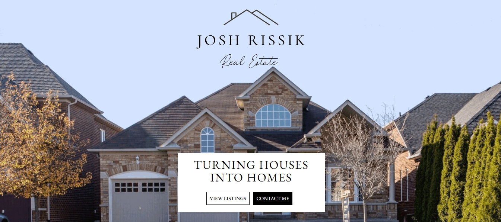
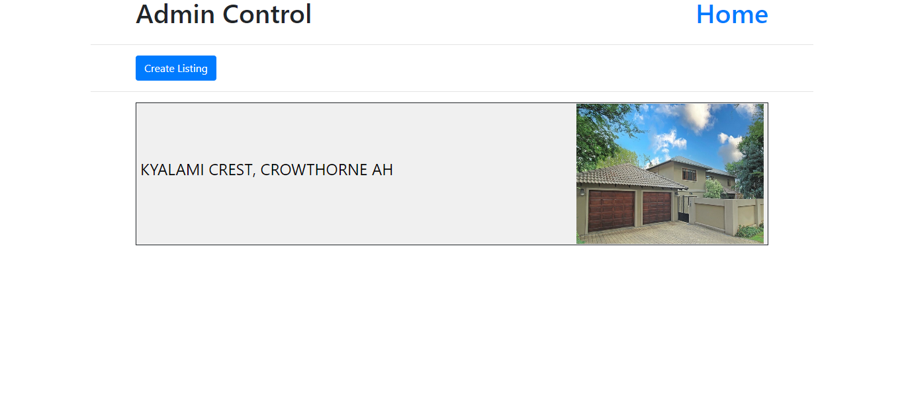
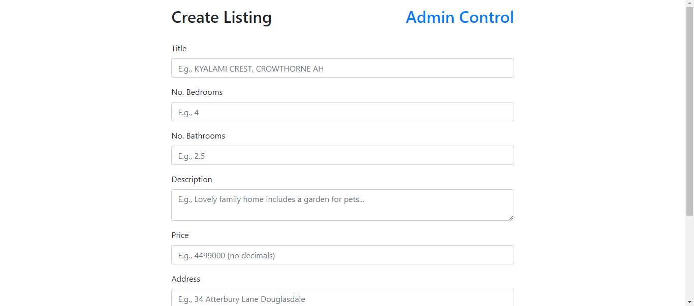
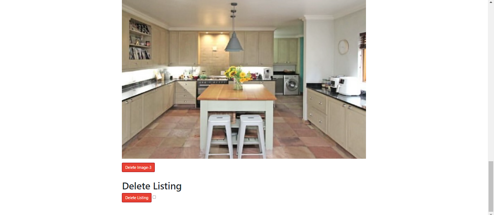
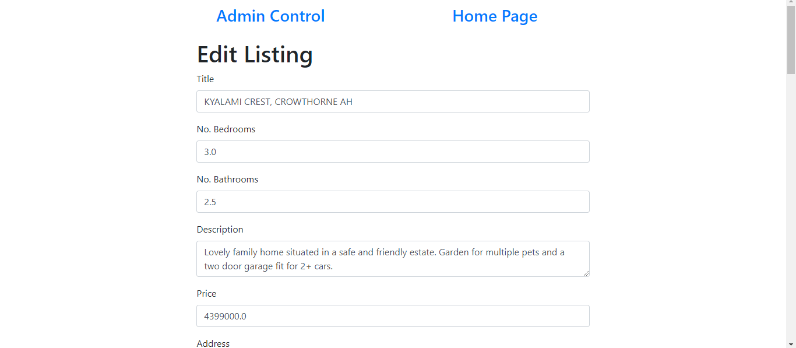

# Real Estate Website: Friend's Website

## Table of Contents
- [Introduction](#introduction)
- [Features](#features)
  - [Customer Side](#customer-side)
  - [Admin Side](#admin-side)
- [Technologies Used](#technologies-used)
- [Usage](#usage)
- [Screenshots](#screenshots)
- [Contact](#contact)

## Introduction
This project is a website created using Flask, HTML, and CSS, along with a database. The website has two main components: a customer side and an admin side. The customer side displays listings, includes an 'About Me' section, and a 'Contact Me' section. The admin side allows for the creation, updating, and deletion of listings, as well as the uploading of photos.

## Features

### Customer Side
- Display Listings: Browse through various listings.
- About Me: Learn more about the website owner.
- Contact Me: Get in touch through a contact form.

### Admin Side
- Create Listings: Add new listings to the website.
- Update Listings: Modify existing listings.
- Delete Listings: Remove listings from the website.
- Upload Photos: Add images to the listings.

## Technologies Used
- Flask
- HTML
- CSS
- SQLite

## Usage
- Access the customer side by navigating [here](https://joshrissikev.pythonanywhere.com/).
- Access the admin side by navigating [here](https://joshrissikev.pythonanywhere.com/admin-login). (To view the admin side/get login details [contact me](#contact).)

## Screenshots
### Home Page

### Responive Home Page

### Admin Control Images

## Contact
- Your Name - [Brandonfourie123@gmail.com](mailto:Brandonfourie123@gmail.com)
- Project Link: [https://github.com/Brolo231/Real-Estate-Website](https://github.com/Brolo231/Real-Estate-Website)

